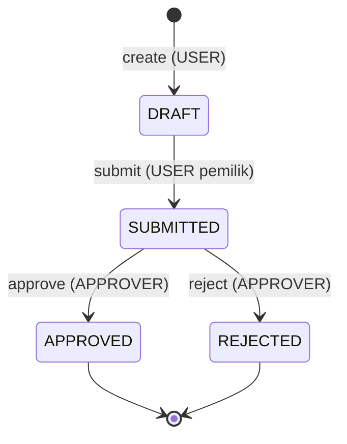
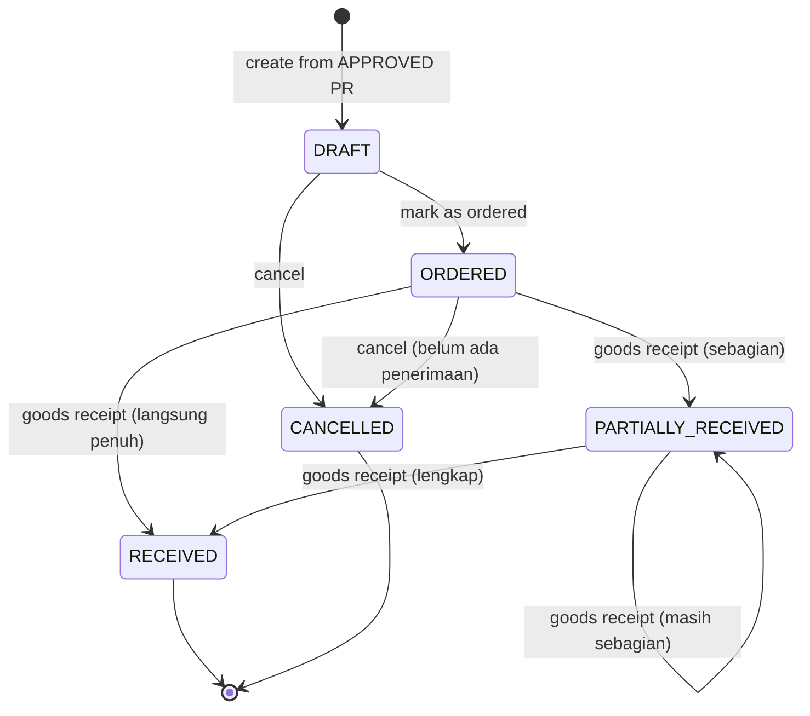

# State Machine

Dokumen ini mendefinisikan status yang valid, transisi yang diizinkan, transisi yang
**dilarang**, dan siapa yang boleh memicu transisi untuk Purchase Request (PR) dan
Purchase Order (PO).

Semua validasi status dilakukan di backend. Kalau ada request transisi yang tidak valid,
API menolak dengan error yang konsisten (lihat [`error-handling.md`](error-handling.md)),
tidak mengubah data apa pun.

---

## 1. Purchase Request

### Status

| status      | arti                                                           | final? |
| ----------- | -------------------------------------------------------------- | ------ |
| `DRAFT`     | Baru dibuat, masih bisa diedit oleh USER pembuatnya            | tidak  |
| `SUBMITTED` | Sudah diajukan, menunggu keputusan APPROVER, tidak bisa diedit | tidak  |
| `APPROVED`  | Disetujui APPROVER, siap dikonversi jadi PO                    | ya     |
| `REJECTED`  | Ditolak APPROVER                                               | ya     |

### Diagram

### Transisi yang diizinkan

| dari        | ke          | trigger | siapa                         | syarat                                                  |
| ----------- | ----------- | ------- | ----------------------------- | ------------------------------------------------------- |
| —           | `DRAFT`     | create  | USER                          | warehouse aktif                                         |
| `DRAFT`     | `SUBMITTED` | submit  | USER pemilik (`requested_by`) | PR punya minimal 1 item; semua product item masih aktif |
| `SUBMITTED` | `APPROVED`  | approve | APPROVER                      | —                                                       |
| `SUBMITTED` | `REJECTED`  | reject  | APPROVER                      | `rejection_reason` wajib diisi                          |

### Aturan edit

- Menambah item, ubah quantity, hapus item, ganti warehouse **hanya boleh saat `DRAFT`**.
- Setelah `SUBMITTED`, PR tidak bisa diedit oleh USER (dan tidak ada endpoint edit untuk
  APPROVER).

### Transisi yang DILARANG

| transisi                          | alasan                                                              | error                                 |
| --------------------------------- | ------------------------------------------------------------------- | ------------------------------------- |
| `DRAFT` → `APPROVED` / `REJECTED` | Approval hanya untuk PR yang sudah `SUBMITTED`                      | `PURCHASE_REQUEST_NOT_SUBMITTED`      |
| `SUBMITTED` → `DRAFT`             | Tidak ada fitur "tarik kembali" — sekali submit, USER lepas kendali | `PURCHASE_REQUEST_INVALID_TRANSITION` |
| `APPROVED` → status apa pun       | `APPROVED` adalah status final                                      | `PURCHASE_REQUEST_INVALID_TRANSITION` |
| `REJECTED` → status apa pun       | `REJECTED` adalah status final; buat PR baru kalau perlu            | `PURCHASE_REQUEST_INVALID_TRANSITION` |
| submit tanpa item                 | PR kosong tidak boleh di-submit                                     | `PURCHASE_REQUEST_EMPTY`              |
| approve/reject oleh USER          | Bukan APPROVER                                                      | `FORBIDDEN`                           |
| edit item saat bukan `DRAFT`      | Hanya `DRAFT` yang bisa diedit                                      | `PURCHASE_REQUEST_NOT_EDITABLE`       |

---

## 2. Purchase Order

### Status

| status               | arti                                                         | final? |
| -------------------- | ------------------------------------------------------------ | ------ |
| `DRAFT`              | PO baru dibuat dari PR `APPROVED`, belum dikirim ke supplier | tidak  |
| `ORDERED`            | Sudah ditandai dipesan ke supplier, siap menerima barang     | tidak  |
| `PARTIALLY_RECEIVED` | Sebagian barang sudah diterima                               | tidak  |
| `RECEIVED`           | Seluruh quantity seluruh product sudah diterima              | ya     |
| `CANCELLED`          | Dibatalkan                                                   | ya     |

### Diagram

### Transisi yang diizinkan

| dari                 | ke                   | trigger         | siapa | syarat                                                                             |
| -------------------- | -------------------- | --------------- | ----- | ---------------------------------------------------------------------------------- |
| —                    | `DRAFT`              | create          | USER  | PR sumber berstatus `APPROVED`; PR belum punya PO; supplier aktif; warehouse aktif |
| `DRAFT`              | `ORDERED`            | mark as ordered | USER  | —                                                                                  |
| `DRAFT`              | `CANCELLED`          | cancel          | USER  | —                                                                                  |
| `ORDERED`            | `CANCELLED`          | cancel          | USER  | belum ada satu pun Goods Receipt untuk PO ini                                      |
| `ORDERED`            | `PARTIALLY_RECEIVED` | goods receipt   | USER  | total diterima \< total dipesan (dihitung ulang setelah GR)                        |
| `ORDERED`            | `RECEIVED`           | goods receipt   | USER  | total diterima == total dipesan untuk semua item                                   |
| `PARTIALLY_RECEIVED` | `PARTIALLY_RECEIVED` | goods receipt   | USER  | masih ada sisa                                                                     |
| `PARTIALLY_RECEIVED` | `RECEIVED`           | goods receipt   | USER  | semua item sudah terpenuhi                                                         |

### Perhitungan status otomatis setelah Goods Receipt

Status PO **tidak** di-set manual saat menerima barang. Setelah setiap Goods Receipt
berhasil, status dihitung ulang dari `purchase_order_items`:

- belum ada barang diterima (semua `received_quantity = 0`) → tetap `ORDERED`
- sebagian diterima → `PARTIALLY_RECEIVED`
- untuk **semua** item, `received_quantity = ordered_quantity` → `RECEIVED`

### Transisi yang DILARANG

| transisi                                  | alasan                                                                  | error                               |
| ----------------------------------------- | ----------------------------------------------------------------------- | ----------------------------------- |
| create PO dari PR non-`APPROVED`          | PO hanya boleh dari PR yang sudah disetujui                             | `PURCHASE_REQUEST_NOT_APPROVED`     |
| create PO kedua dari PR yang sama         | 1 PR maksimal 1 PO (dijaga juga oleh UNIQUE di DB)                      | `PURCHASE_ORDER_ALREADY_EXISTS`     |
| Goods Receipt saat status `DRAFT`         | PO harus `ORDERED` dulu sebelum bisa menerima barang                    | `PURCHASE_ORDER_NOT_RECEIVABLE`     |
| Goods Receipt saat status `RECEIVED`      | PO yang `RECEIVED` tidak bisa menerima barang lagi                      | `PURCHASE_ORDER_NOT_RECEIVABLE`     |
| Goods Receipt saat status `CANCELLED`     | PO yang `CANCELLED` tidak bisa menerima barang                          | `PURCHASE_ORDER_NOT_RECEIVABLE`     |
| `RECEIVED` → status apa pun               | status final                                                            | `PURCHASE_ORDER_INVALID_TRANSITION` |
| `CANCELLED` → status apa pun              | status final                                                            | `PURCHASE_ORDER_INVALID_TRANSITION` |
| cancel PO yang sudah `PARTIALLY_RECEIVED` | barang sudah masuk gudang, pembatalan butuh proses lain (di luar scope) | `PURCHASE_ORDER_INVALID_TRANSITION` |
| `ORDERED` → `DRAFT`                       | tidak ada fitur "batal pesan"                                           | `PURCHASE_ORDER_INVALID_TRANSITION` |
| mark as ordered saat bukan `DRAFT`        | hanya `DRAFT` yang bisa ditandai dipesan                                | `PURCHASE_ORDER_INVALID_TRANSITION` |
| terima quantity melebihi sisa             | total diterima tidak boleh \> `ordered_quantity`                        | `GOODS_RECEIPT_QUANTITY_EXCEEDED`   |

---

## 3. Catatan asumsi

Beberapa hal tidak diatur eksplisit di requirement, diputuskan sebagai berikut (dicatat
juga di [`../ASSUMPTIONS.md`](../ASSUMPTIONS.md)):

- **Siapa yang membuat PO / mark as ordered / mencatat GR.** Requirement hanya punya
  role `USER` dan `APPROVER`, dan `APPROVER` khusus approval. Jadi semua aksi PO dan GR
  dilakukan oleh `USER` (staff purchasing dianggap `USER` juga).
- **PR yang `REJECTED` tidak bisa di-resubmit.** Kalau masih dibutuhkan, buat PR baru.
- **PO mulai dari `DRAFT`, bukan langsung `ORDERED`.** Ada langkah "Mark as Ordered"
  yang terpisah sesuai daftar capability.
- **Cancel PO hanya boleh sebelum ada penerimaan** (`DRAFT` atau `ORDERED`). Setelah ada
  barang masuk, pembatalan dianggap di luar scope.
